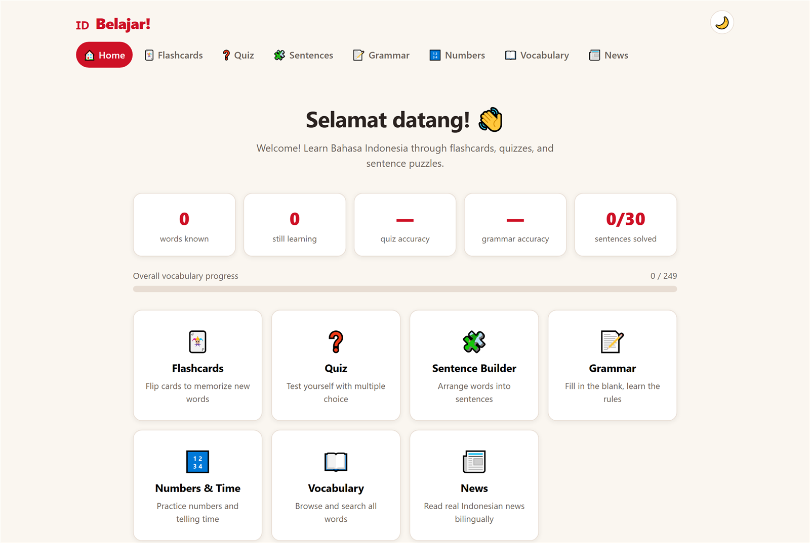

# Belajar! 🇮🇩 — Learn Bahasa Indonesia

An interactive web app for learning Bahasa Indonesia, built with React, TypeScript, and Vite.

**🌐 Try it live: [pinardy.github.io/learn-bahasa-indonesia](https://pinardy.github.io/learn-bahasa-indonesia/)**

<p align="center">
  
</p>

## Features

- **🃏 Flashcards** — flip cards to memorize words, filter by category, and mark each word as "known" or "still learning"
- **❓ Quiz** — 10-question rounds in three modes: multiple choice (both Indonesian → English and English → Indonesian), typed recall (see the English, type the Indonesian — minor typos are forgiven), and listening (hear the word, choose its meaning)
- **🧩 Sentence Builder** — arrange shuffled word tiles to translate English sentences into Indonesian
- **📖 Vocabulary browser** — search and browse 240+ words across 20 categories (greetings, numbers, food, family, travel, verbs, adjectives, time, colors, body, animals, nature & weather, household, question words, around town, transportation, jobs, feelings, clothing, money & shopping)
- **📰 News** — read real headlines from CNN Indonesia, Antara, CNBC Indonesia, Tempo, and Republika; tap any word for its English meaning, then reveal the full English translation to check your understanding
- **📊 Progress tracking** — words known, quiz accuracy, and sentences solved are saved to localStorage
- **💾 Backup & restore** — export all your progress (known words, SRS schedule, saved words, stats, unlocked units) to a JSON file from the home screen, and import it back on any device; an unrecognized file is rejected rather than overwriting your data
- **🎯 Learning path** — a guided course through the vocabulary: units in pedagogical order on the home screen; master 70% of a unit's words, then pass its checkpoint quiz to unlock the next
- **🗣️ Phrasebook & pronunciation** — survival phrases for real situations (restaurant, directions, shopping, emergencies…) plus a guide to the sounds that differ from English, all speakable
- **🎤 Speaking practice** — say words and phrases aloud; browser speech recognition (Chrome/Android) checks your pronunciation
- **✏️ Phrase practice** — quiz yourself on the phrasebook so the phrases actually stick
- **📖 Beginner stories** — hand-written graded stories with the same tap-a-word, save, and readability tools as the news reader
- **⏰ Spaced repetition** — grading a flashcard schedules it on a Leitner-box interval (1 → 2 → 4 → 9 → 18 days); the home screen shows how many words are due and a "Due for review" deck resurfaces them right before you'd forget. Quiz answers feed the same schedule: a miss sends the word back to box 1 and into the review rotation, a correct answer advances words already being reviewed
- **🔊 Audio pronunciation** — tap the speaker on any word, flashcard, quiz answer, sentence, or news word to hear it spoken in Indonesian (browser-native text-to-speech; works offline)
- **📱 Installable PWA** — add it to your phone's home screen; the whole app works offline, including previously loaded news and cached translations

## Getting started

```bash
npm install
npm run dev
```

Then open the URL Vite prints (default http://localhost:5173).

## Scripts

- `npm run dev` — start the dev server
- `npm run build` — type-check and build for production
- `npm run preview` — preview the production build

## Adding content

- Words live in `src/data/vocabulary.ts` — add an entry to `WORDS` (with optional example sentence)
- Sentences for the builder live in `src/data/sentences.ts`
- New categories: add to `CATEGORIES` and the `CategoryId` type in `src/types.ts`
- News sources live in `src/services/news.ts` (`NEWS_SOURCES`)

## News & translation services

The News tab fetches live headlines from the community-run
[berita-indo-api](https://berita-indo-api-next.vercel.app) and translates them on demand via
Google Translate's free web endpoint — no API keys required. Translations are cached in
localStorage, and if the news API is unreachable the tab falls back to bundled bilingual
practice articles.
